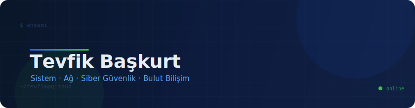

&nbsp;

## Tevfik Başkurt

**Sistem · Ağ · Siber Güvenlik · Bulut Bilişim**

---

Merhaba, ben Tevfik Başkurt. Sistem yöneticiliği, ağ mimarileri ve siber güvenlik alanlarında çalışan, güncel teknolojileri yakından takip eden bir bilişim profesyoneliyim. Kariyerime lise yıllarımda Linux işletim sistemine duyduğum hevesle başladım. Şu an Debian sunucu yönetimi ve sistem güvenliği alanında ilerliyor, geleceğimi buluta kodlayarak yoluma devam ediyorum.

&nbsp;

### Uzmanlık Alanları

<table>
<tr>
<td align="center" width="25%">

  <b>Bulut & DevOps</b>
</td>
<td align="center" width="25%">

  <b>Geliştirme</b>
</td>
<td align="center" width="25%">

  <b>Altyapı</b>
</td>
<td align="center" width="25%">

  <b>Donanım & IoT</b>
</td>
</tr>
</table>

 

<code>Linux Sistem Yönetimi</code> &nbsp;
<code>Ağ Güvenliği</code> &nbsp;
<code>Pentesting</code> &nbsp;
<code>Sanallaştırma</code> &nbsp;
<code>CI/CD</code> &nbsp;
<code>IoT</code>

---

### Şu Anda

<table>
<tr>
<td>

ÖĞRENİYORUM
 
İleri Kubernetes, Servis Mesh (Istio) ve Zero-Trust ağ güvenliği

</td>
</tr>
<tr>
<td>

GELİŞTİRİYORUM
 
Kişisel sitem [tevfikbaskurt.dev](https://tevfikbaskurt.dev) (Next.js + Prisma) ve ev laboratuvarımda Kubernetes kümesi

</td>
</tr>
<tr>
<td>

KONUŞABİLECEĞİMİZ
 
Bulut mimarileri, DevOps, siber güvenlik, sistem otomasyonu

</td>
</tr>
</table>

---

### Bağlantılar

---

Mersin, Türkiye

